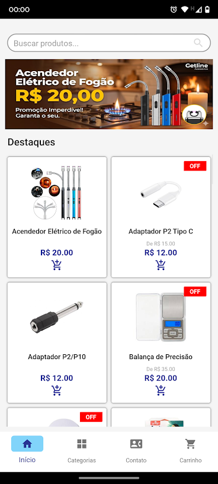
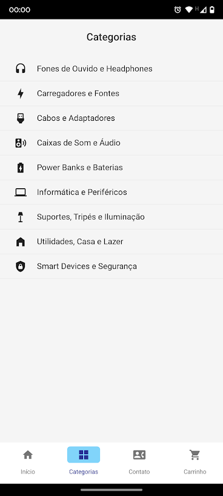
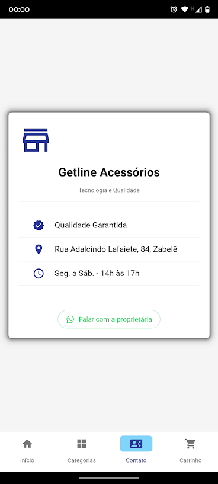
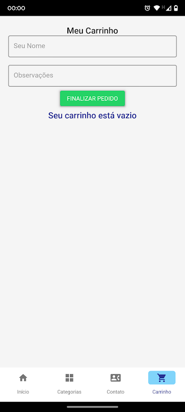
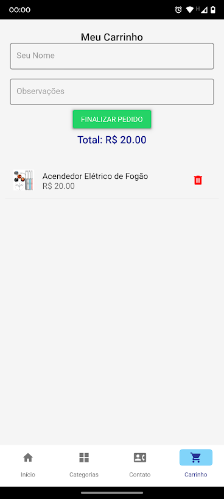

# Getline Acessórios - Vitrine Virtual

Este é um aplicativo mobile nativo (Android) desenvolvido para a transformação digital do comércio local. O app funciona como uma vitrine virtual para a loja **Getline Acessórios** (Zabelê - PB), conectando clientes diretamente ao estoque local e simplificando o processo de compra via WhatsApp.

## IMAGENS DO PROJETO

| Tela Inicial | Categorias | Contato | Carrinho_vazio | Carrinho |
|:---:|:---:|:---:|:---:|:---:|
|  |  |  |  |  

## Funcionalidades

* **Catálogo Dinâmico:** Visualização de produtos atualizados em tempo real via API na nuvem.
* **Busca Inteligente:** Pesquisa de produtos por nome ou através de atalhos de categorias.
* **Carrinho de Compras:** Adição e remoção de itens, com cálculo automático do valor total.
* **Checkout via WhatsApp:** Ao finalizar o pedido, o app formata a lista de compras e envia diretamente para o WhatsApp do vendedor (Deep Linking), eliminando burocracias de cadastro.
* **Banners Promocionais:** Carrossel de ofertas gerenciado remotamente.
* **Informações da Loja:** Cartão de visita digital com localização e horários.

## Como Baixar e Instalar (Para Usuários)

1.  Baixe o arquivo **`Getlineapp_v1.0.apk`** da seção "Releases" deste repositório (ou link disponibilizado).
2.  Transfira o arquivo para o seu celular Android.
3.  Clique no arquivo para instalar.
    * *Nota:* Se o Android pedir permissão para "Instalar de fontes desconhecidas", habilite a opção nas configurações.
4.  Abra o aplicativo **Getline** e aproveite!

## Como Executar o Projeto (Para Desenvolvedores)

Este projeto é dividido em **Frontend** (App) e **Backend** (API).

### Pré-requisitos
* Python 3.10+
* Git

### 1. Clonar o repositório
```bash
git clone [https://github.com/tfneves27/projeto-getline.git](https://github.com/tfneves27/projeto-getline.git)
cd projeto-getline
```
### 2. CONFIGURAR E RODAR (FRONTEND)
Navegue até a pasta do aplicativo:

```Bash
cd frontend
```
Crie e ative um ambiente virtual:

```Bash
python -m venv venv
# No Windows:
.\venv\Scripts\activate
# No Linux/Mac:
source venv/bin/activate
```
Instale as dependências:

```Bash

pip install -r requirements.txt
```
Execute o aplicativo no PC:
```Bash
python main.py
```
### 3. BACKEND (OPCIONAL)
O aplicativo já está configurado para consumir a API oficial hospedada na nuvem (Render). Caso queira rodar o servidor localmente:

```Bash
cd backend
pip install -r requirements.txt
uvicorn main:app --reload
```
## TECNOLOGIAS UTILIZADAS
* PYTHON 3.10+
* KIVY & KIVYMD (Interface Gráfica Mobile e Material Design)
* FASTAPI (Backend/API REST de alta performance)
* HTTPX & ASYNCIO (Comunicação assíncrona com a API)
* BUILDOZER (Empacotamento para Android APK)
* RENDER (Hospedagem em Nuvem)

## AUTOR
**Tiago Félix Neves**

Desenvolvido como Projeto de Extensão Universitária.
